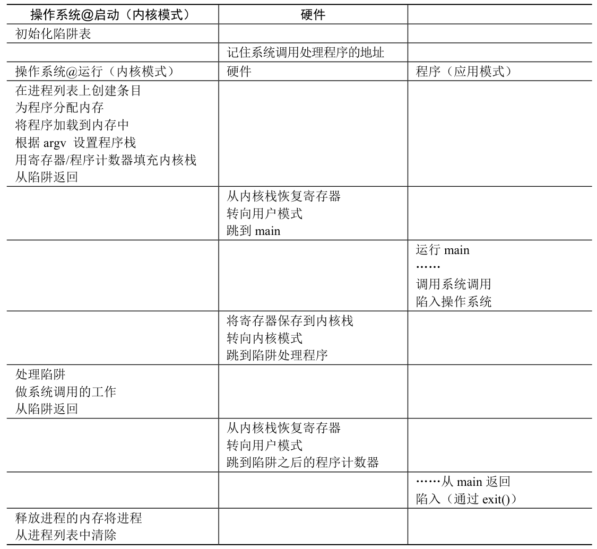

# 深入剖析：write() 系统调用的 CPU 执行级物理流程

**前置知识：** 在程序启动时，操作系统已经将用户编写的程序代码（如 `main`）和 C 标准库的动态链接库（`libc.so`）共同映射到了当前进程的**虚拟内存空间**中。此时，它们是相邻的内存块。

---

### 🎬 第一幕：CPU 在用户代码区游走
* **当前状态：** CPU 处于**用户模式（特权级 3）**，程序计数器（PC）正指向用户编写的 `main` 函数所在的内存区域。
* **发生动作：** CPU 顺序读取机器指令，遇到了一条由 `write(fd, "hello", 5);` 编译而来的跳转指令（`call <write函数在glibc中的内存地址>`）。
* **结果：** CPU 将 PC 指针更新，直接跳转到同一虚拟内存空间中，属于 glibc 所在的那块内存区域。

### 🎬 第二幕：CPU 在 glibc 代码区“填表”
* **当前状态：** CPU 依然处于**用户模式（特权级 3）**，但此时 PC 指针正在读取 glibc 提供的一小段“包装代码”。
* **发生动作：** 库本身是死物，是 **CPU 在执行这段库代码**。CPU 按照指令的安排，将物理寄存器填满：
  1. CPU 将参数放入特定的寄存器：`rdi = fd`，`rsi = "hello"的内存地址`，`rdx = 5`。
  2. CPU 将 `write` 的系统调用号（编号 `1`）放入 `rax` 寄存器。
* **结果：** 此时 CPU 的各个物理寄存器已经装满了系统调用所需的全部上下文信息。

### 🎬 第三幕：硬件级越权（Trap 触发）
* **发生动作：** CPU 读取到了 glibc 代码中的下一条指令：**`syscall`**。
* **物理异变：** 这是一个特殊的硬件指令，它会触发 CPU 内部的硬连线逻辑：
  1. **状态保存：** CPU 硬件自动将当前的 PC 指针和状态寄存器压入该进程专属的**内核栈（Kernel Stack）**中。
  2. **权限反转：** CPU 内部的特权级物理开关瞬间从 `3（用户态）` 拨动到 `0（内核态）`。
  3. **强制跳转：** CPU 硬件查询“中断描述符表（IDT）”，强行将 PC 指针修改为操作系统内核中预设的系统调用处理程序的内存地址。

### 🎬 第四幕：CPU 在内核代码区办事（上帝模式）
* **当前状态：** CPU 此时处于**内核模式（特权级 0）**，拥有对所有物理硬件的绝对控制权。PC 指针正在读取操作系统的内核代码。
* **发生动作：**
  1. **查表分发：** CPU 执行内核代码，读取 `rax` 寄存器发现是 `1`，随后跳转到内核中专门处理 `sys_write` 的子程序。
  2. **执行特权操作：** CPU 验证参数的合法性，并向硬盘控制器或管道内存缓冲区发出特权级别的物理写入指令。
  3. **写入结果：** I/O 操作完成后，CPU 将结果（例如成功写入的字节数 `5`）写入 `rax` 寄存器。
* **退朝：** CPU 读取到内核代码的最后一条指令 **`sysret`**（或 `iret`）。硬件再次接管，将特权级开关拨回 `3`，并从内核栈中弹出之前保存的 PC 指针。

### 🎬 第五幕：CPU 降级返回 glibc 区
* **当前状态：** CPU 恢复为**用户模式（特权级 3）**，PC 指针准确地回到了刚才 glibc 中 `syscall` 指令的下一行。
* **发生动作：** CPU 继续执行 glibc 的剩余代码。
  1. CPU 检查 `rax` 寄存器的值。
  2. 若为负数，CPU 将错误码写入进程内存中的 `errno` 变量，并将返回值设为 `-1`。
  3. CPU 执行 `ret`（返回）指令。
* **结果：** PC 指针再次跳跃，回到了用户的 `main` 函数中 `write()` 调用的下一行代码。整个系统调用在物理层面上闭环结束。

# 时间线流程

### 🎬第一阶段：开机时刻（创世）
* **OS 动作：** 电脑刚开机，OS 是唯一的真神（内核模式）。它赶紧初始化陷阱表，规划好各种“接待室”的位置。
* **硬件动作：** CPU 硬件把这些接待室的地址牢牢记在自己的特殊寄存器里。准备工作完成。
### 🎬第二阶段：启动你的程序（假装“退朝”）
* **shell到OS：** 当你在终端敲下 ./hw4 并回车的瞬间，Shell 就立刻把 OS 唤醒了！
  1. Shell 在干活（用户模式）： 没错，当你在终端敲入 ./hw4 时，真正在 CPU 上跑的是 Shell（比如 Bash 或 Zsh）这个用户进程。此时，OS 确实在沉睡。
  2. 遇到回车，触发陷阱： Shell 只是个平民，它没有权限去硬盘里把 hw4 搬到内存里，更没有权限去给 hw4 分配独立的内存空间。
  3. Shell 呼叫 OS（Trap）： 所以，当 Shell 读到你的回车键后，它在底层立刻调用了我们之前学过的大招 —— fork() 和 execvp()！
  4. OS 苏醒接管（内核模式）： 记住，fork 和 exec 都是系统调用（System Call）！一旦执行，硬件立刻触发 trap，没收 Shell 的 CPU 控制权，瞬间把特权级提升为上帝模式，唤醒了沉睡的 OS 内核。
  5. 结论： 所以，在准备运行 hw4 的前夕，CPU 早就已经不在 Shell 手里了，而是稳稳地被 OS 握在手里。OS 正在以最高权限为你分配内存、加载 hw4 的代码。
* **狸猫换太子：** 为什么要用“假装从陷阱返回”这么奇怪的招数？
  1. 好，现在 OS 已经把 hw4 加载到内存里了，准备让它跑起来。OS 处于上帝模式（内核态，特权级 0），而 hw4 必须运行在平民模式（用户态，特权级 3）。OS 想要把 CPU 交给 hw4，面临着一个极其尴尬的硬件物理限制：硬件规定：从内核态降级回到用户态，并且跳转执行代码的唯一合法指令，只有一条，那就是 return-from-trap（从陷阱返回）。
  但这引发了一个巨大的逻辑悖论：
    * return-from-trap 的本意是：一个程序之前执行了 trap 进来了，现在原路退回去（恢复之前保存在内核栈里的旧数据）。
    * 但是，hw4 是一个刚刚诞生、全新出炉的婴儿程序啊！ 它以前从来没有运行过，更没有触发过什么 trap。内核栈里根本没有它的“历史遗留数据”。如果直接执行返回，硬件会去内存里乱读一气，程序直接崩溃。
  2. 既然硬件是个死脑筋，只认 return-from-trap 这一条指令，且必须从内核栈里读取数据来恢复现场。那么，操作系统的内核工程师们就玩了一个狸猫换太子的骗术：
    * 伪造内核栈： OS 在准备交出 CPU 之前，偷偷地在 hw4 的内核栈里塞入了一套伪造的数据。
    * 塞入什么假数据？
      * 它把程序计数器（PC）的值，硬生生写成了 hw4 代码的第一行地址（_start 或 main）。
      * 它把权限状态位写成了平民模式（特权级 3）。
      * 它把其他寄存器全部清零。
    * 按下核按钮： 伪造完现场后，OS 信心满满地执行了硬件指令：return-from-trap。
    * 硬件上当受骗： 硬件忠实地执行指令，它从内核栈里“恢复”数据。硬件根本不知道这些数据是 OS 刚刚伪造的。硬件乖乖地把特权级降到了 3，并把 CPU 指针指向了 OS 伪造的那个地址（也就是 hw4 的第一行）。
### 🎬第三阶段：运行时求助（系统调用）
* **程序动作：** 你的程序跑着跑着，调用了 write，底层触发了 trap（陷入操作系统）。
* **硬件动作：** 硬件立刻夺取控制权！它把你程序当前跑到了哪一行、寄存器里有什么，全都保存到内核栈里。然后把权限升级为上帝（内核模式），查阅陷阱表，跳转到 OS 的接待室。
* **OS 动作：** OS 在接待室醒来，检查你想干嘛（哦，想往屏幕写 "hello"）。检查合法后，OS 操纵显示器把字打出来。干完活，OS 再次呼叫 return-from-trap。
* **硬件动作：** 硬件再次把内核栈里你的数据掏出来，恢复现场，降级权限，跳回你 write 代码的下一行。
* **程序动作：** 你的程序继续往下跑，浑然不知中间发生了一次惊心动魄的跨阶级旅行。
### 🎬第四阶段：程序结束（死亡与清理）
* **程序动作：** 你的 main 函数跑到了 return 0;。在底层，C 标准库会替你调用一个最终的系统调用：exit()。这又是一次 trap。
* **OS 动作：** OS 收到 exit 请求，知道你活到头了。它大手一挥，把你占用的内存、打开的文件描述符全部释放，将你从进程列表中无情抹除。