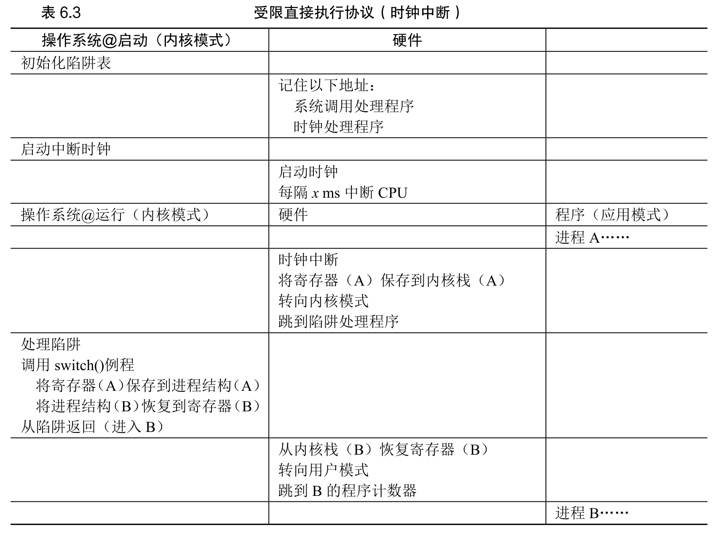

## 事件一：进程的诞生（也就是你敲下 ./hw4 的那一瞬间）
当你在 Shell 里敲下回车，触发操作系统的 exec 加载程序时，OS 是专门在为 B 服务的。此时，OS 根本不需要“选中”B，因为现在就是 B 的出生时刻。

* **建档与分配（步骤 1）**： OS 为 B 创建了 PCB（员工花名册档案），分配了内存，并建好了属于 B 的空内核栈。

* **读说明书并伪造现场（步骤 2）**： 因为 OS 正在加载 B，它理所当然地读取了 B 的 ELF 文件头，拿到了 B 的入口地址（main）。OS 趁热打铁，把这个地址和“平民权限”塞进了 B 的内核栈。

* **推入候场区（关键分水岭）**： 伪造完之后，OS 并没有立刻让 B 运行！而是给 B 贴上一个标签叫 “就绪状态 (Ready)”，然后把 B 扔进了一个叫“就绪队列 (Ready Queue)”的候车室里。

* 至此，关于 B 的“伪造准备工作”已经彻底完成了。接下来，OS 就不管 B 了，继续去忙别的，或者让 A 继续跑。

## 事件二：进程的调度（可能是几毫秒甚至几秒之后）
时间流逝。进程 A 正在 CPU 上跑得正欢，突然，时钟发生中断（时间片用完了），CPU 强制陷入内核态。此时，操作系统的调度程序（Scheduler）醒了，开始执行我们说的后面两步：

* **保存 A 的现场**： 硬件把 A 当前运行到哪里的状态，压入了 A 自己的内核栈。

* **花名册选人（步骤 3）**： OS 的调度器去“就绪队列”这个候车室里看了一圈，发现里面坐着 B、C、D。OS 的算法算了一下，决定：“好，下一个让 B 上台！”

* **切换栈指针**： 既然决定了选 B，OS 就执行那句核心汇编，把 CPU 的栈指针寄存器（SP），从 A 的内核栈，一把切到了 B 的内核栈。

* **见证奇迹（步骤 4）**： OS 喊出 return-from-trap。硬件去当前的栈（已经是 B 的栈了）里掏数据。

请注意：硬件此时掏出来的 B 的 main 函数地址，是事件一中，OS 早就提前几个世纪放在那里的！

## 基础概念

* OS 在内核区划出一块几 KB 的空地，挂个牌子：“这是新进程 B 的内核栈”。同时在 OS 自己的“员工花名册”（这叫进程控制块 PCB）里，记下这个栈的物理内存地址。所以，OS 绝对知道它在哪，因为就是 OS 亲手建的！
* PCB：进程的“数字身份证”
PCB (Process Control Block)，中文叫 进程控制块。
你可以把它想象成操作系统为每个进程建立的一份“人事档案”。当你的程序 ./hw4 运行起来变成一个进程时，操作系统（内核）就会在内存里开辟一块空间，存入这个 PCB 结构体。
PCB 里装了什么？
 1. PID： 进程的唯一身份证号。
 2. 状态： 进程现在是在跑（Running）、在等（Waiting）还是准备好了（Ready）。
 3. 上下文保存区： 这是最关键的！当进程 A 被切走时，它那一瞬间的 CPU 寄存器数值（PC、SP 等）都会被抄写到 PCB 的这个区域里。
 4. 内存指针： 记录这个进程的代码、数据、用户栈都在内存的什么位置。
 5. 资源清单： 进程打开了哪些文件（fd）、申请了多少内存等。
* 内核栈
 1. 每个进程在诞生时，操作系统都会在内核空间（Kernel Space）的地址范围内，为它分配一段固定大小（通常是 8KB 或 16KB）的连续内存区域，这就是内核栈。
 2. 为什么要放在内存里？ 因为栈本身就是一种数据结构，需要大量的读写操作，内存是最合适的物理载体。
 3. 独立性： 每个进程都有自己独立的内核栈。进程 A 陷入内核时用的是 A 的内核栈，进程 B 用的是 B 的，这样它们在内核里处理系统调用时才不会把数据搞混。

 ## 流程图

 
 ### 关键步骤
 在操作系统的内核源码里，真正执行上下文切换的通常是一个用纯汇编手工编写的极小函数（一般叫 swtch 或 context_switch）。假设现在 OS 决定把 CPU 从 A 切给 B。OS 会调用这个函数，并且传入两个参数：A 的 PCB 地址 和 B 的 PCB 地址。底层硬件极其机械地执行了下面这几步：
 * 保存 A 的残局（写回 A 的 PCB）
  1. 此时，CPU 的 SP 寄存器还指着 A 的内核栈。
  2. PU 先把当前的各种通用寄存器（由于之前的中断，很多数据已经压入 A 的内核栈了，这里保存的是调度器本身运行时的寄存器）全部 push 到 A 的内核栈里。  
  3. 最致命的一步来了： CPU 把当前自己体内的 SP 寄存器的值，老老实实地写入到 A 的 PCB 结构体中的 context.sp 字段 里。
* 核心大掉包（从 B 的 PCB 提取 SP）
  1. 接下来，CPU 去内存里读取 B 的 PCB。
  2. CPU 找到 B 的 PCB 里的 context.sp 字段（这个字段记录了 B 上次被切走时，或者 B 刚被创建伪造现场时，它的内核栈顶在哪）。
  3. 见证奇迹的指令： CPU 直接把读到的这个地址，强行覆盖写入自己体内的 SP 寄存器！
* 恢复 B 的残局（从 B 的栈弹回 CPU）
  1. 既然 SP 已经指着 B 的内核栈了，接下来就好办了。
  2. CPU 开始疯狂执行 pop 指令。
  3. 硬件乖乖地从 B 的内核栈里，把 B 以前保存的寄存器数值（或者 OS 伪造的初始数值）一个个弹出来，装填进 CPU 对应的寄存器里。
  4. 最后执行 ret（或者 return-from-trap），把 B 的 main 函数地址（或者 B 之前中断的地方）弹进 PC 寄存器。
  5. B 满血复活，继续执行！
* 你会发现，操作系统把数据（现场信息）和元数据（指针）做了一个极其漂亮的隔离：
  1. 笨重的数据（几百个字节的寄存器现场），全部扔在各自的“内核栈”里。
  2. 轻巧的线索（只有 8 个字节的栈顶地址），保存在“PCB”里。
  3. 上下文切换时，OS 根本不需要去搬运那几百个字节的笨重数据。它只需要交换一下 PCB 里的那根 8 字节的指针，就像扳动了铁轨的道岔一样，整辆火车的执行流就瞬间变道了。