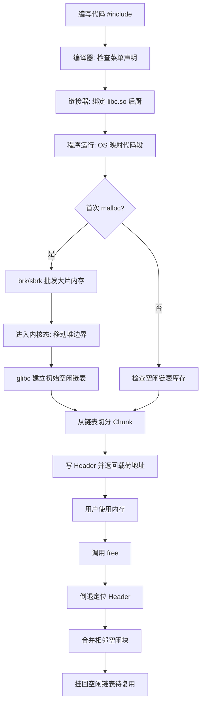

# C 语言内存管理完整流程：从源代码到物理内存

本文整合了 `malloc`/`free` 底层原理、glibc 的 Chunk 与空闲链表设计、批发零售机制、`brk`/`sbrk` 系统调用以及头文件与库文件的区别，形成一个从编译时到运行时的完整知识流程。

---

## 流程总览

```text
[编写代码] → [编译链接] → [程序启动] → [首次 malloc] → [后续 malloc] → [free 释放] → [合并与复用]
```

---

## 阶段一：编译与链接 —— 菜单与后厨

### 1. 头文件（.h）只是“菜单”
当你写下 `#include <stdlib.h>` 时，文件中仅包含函数声明：

```c
void *malloc(size_t size);
```

* **作用**：告知编译器 `malloc` 的存在、参数与返回值类型，确保语法检查通过。
* **不包含**：任何真实的内存分配逻辑代码。

### 2. 真正的代码在“后厨” —— 动态链接库
* **文件**：`libc.so`（Linux 下 glibc 的动态库）。
* **内容**：预编译好的二进制机器码，包含管理内存块、空闲链表、系统调用等全部逻辑。
* **链接方式**：链接器默认将 `libc.so` 绑定到你的程序。

### 3. 运行时的映射
当程序执行时，操作系统将 `libc.so` 的代码段映射到进程的虚拟内存中。此时，glibc 的“会计逻辑”常驻内存（只读）。

---

## 阶段二：程序启动 —— 申请第一块批发仓库

### 1. 初始状态：glibc 手里没货
刚启动时，glibc 尚未向操作系统申请任何堆内存，其维护的空闲链表为空。

### 2. 首次 malloc（或库存耗尽时）—— 大宗批发
当你调用 `malloc(40)`，glibc 发现库存不足，于是执行以下操作：

* **触发系统调用**：`brk` 或 `mmap`。
* **“狮子大开口”**：出于性能考虑，glibc 不会只申请 40 字节，而是向 OS 申请一大片内存（例如 132 KB）。
* **内核动作**：操作系统将进程堆区的程序断点向外推移，扩展进程的堆区虚拟地址范围。实际物理页通常不是一次性全部分配，而是在程序首次访问对应虚拟页时，由缺页异常触发内核按需分配并建立页表映射。
* **退回用户态**：glibc 获得该连续内存的控制权。

> **本质**：`brk` / `sbrk` 是移动堆区边界的“铁丝网”。

---

## 阶段三：malloc 分配 —— 切分与记账

### 1. 空闲链表（Free List）：账本藏在内存里
glibc 将整块内存视为一个巨大的 **Free Chunk**，并在内存块内部写入元数据：

```text
[ Header (size=132KB) | 指向下一个空块的指针 | 指向前一个空块的指针 | 剩余空白 ]
```
* **关键设计**：空闲内存本身被当作账本使用，无需额外分配数据结构来记录。

### 2. 切分 40 字节（用户态极速执行）
1.  **查找**：从空闲链表中找到足够大的 Chunk。
2.  **切分**：切出 `48 字节`（8 字节 Header + 40 字节载荷）。
3.  **标记**：在 Header 中写入 `size = 48`，并标记为“已分配（Allocated）”。
4.  **更新**：更新剩余大块的 Header 信息，并重新挂入空闲链表。
5.  **返回**：跳过 Header 长度，返回载荷起始地址给用户。

**内存布局对比：**
* **用户视角**：`[ 40 字节可用空间 ]`
* **实际虚拟地址布局**：`[  Chunk Header | 用户载荷 Payload ]`（返回的指针指向载荷起始位置）这些地址在虚拟空间中连续，但背后的物理页不一定连续。。

### 3. 后续调用
后续的 `malloc` 优先从空闲链表中切分，全程在**用户态**执行，无需进入内核，速度极快。

---

## 阶段四：free 释放 —— 顺藤摸瓜与合并

### 1. 定位 Header
调用 `free(ptr)` 时，glibc 拿到指针后执行“倒退”操作：
* 自动倒退 8 字节（Header 大小），读取 `size` 字段，从而得知整个块的大小。

### 2. 释放与合并
* 将该块标记为“空闲”。
* **向前/向后合并**：检查相邻的 Chunk。如果邻居也是空闲的，则将它们合并成一个更大的 Chunk，减少内存碎片。
* **重写指针**：在合并后的空闲块内部写入 `next`/`prev` 指针，挂回空闲链表。

### 3. 绝不立刻归还 OS
释放的内存通常留给 glibc 后续复用，不会立即通过 `brk` 归还给 OS。只有当堆顶出现极大的连续空闲区域且达到阈值时，才会触发收缩。

---

## 阶段五：特殊场景 —— 为什么不能手动调用 brk/sbrk？

glibc 在堆区内部维护了极其复杂的元数据一致性。如果你绕过 glibc 直接移动断点：
1.  **悬垂引用**：可能导致 glibc 以为某块内存有效，实则已被退还给 OS 导致崩溃。
2.  **账本错乱**：glibc 无法感知你手动扩展或收缩的空间，导致空闲链表与实际物理布局冲突。

**后果**：内存泄漏、段错误（Segmentation Fault）或无迹寻踪的数据损坏。

---

## 核心概念汇总对照表

| 概念 | 角色 / 比喻 | 发生阶段 | 是否进入内核态 |
| :--- | :--- | :--- | :--- |
| **头文件 <stdlib.h>** | 菜单（函数声明） | 编译时 | 否 |
| **glibc 库文件** | 后厨（实现逻辑） | 链接/运行时 | 否 |
| **malloc (普通调用)** | 零售（链表切分） | 运行时 | 否 |
| **brk / sbrk** | 批发（移动堆边界） | 运行时 | **是** |
| **Header (元数据)** | 账本（记录状态） | 内存操作 | 否 |
| **Free Chunk** | 空地即账本（存指针） | 运行时 | 否 |

---

## 完整逻辑流程图



---

## 总结

1.  **头文件 = 菜单**，只负责让编译器“认识”函数。
2.  **glibc 库 = 后厨**，包含真实的内存管理算法。
3.  **malloc = 零售商**，优先从库存（空闲链表）切分，库存不足才找 OS 批发。
4.  **brk/sbrk = 批发渠道**，直接操作硬件页表移动堆边界。
5.  **Header + 指针 = 隐形账本**，巧妙地利用空闲内存空间进行自我管理。

⚠️ **核心教训**：永远不要直接调用 `brk/sbrk`，请让 glibc 这个专业的“内存管家”全权处理。